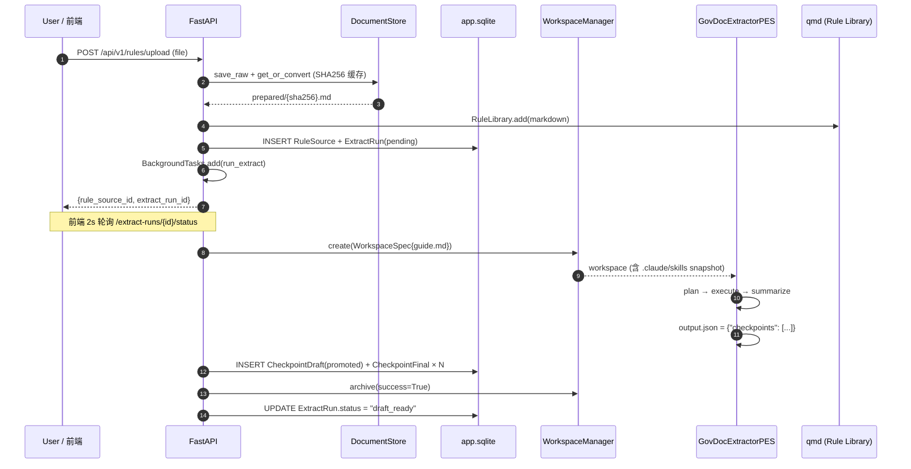

# GovDoc Auditor V3 — 架构速读

> **本文定位**: 快速上手的"架构地图"。不是设计规范（权威在 `docs/design.md`），不是数据流详表（那在 `docs/data-flow.md`）。目标是让你**30 分钟掌握全局 + 按需深钻**。
>
> **读法建议**: 按顺序读 §1 → §3 → §4，剩下按需查。每一节结尾有 📍 标注指向的**代码锚点**。

---

## 1. 一句话定位

> 把"法律指引 PDF/DOCX"和"招标文书 PDF/DOCX"喂给系统，系统调 LLM agent 先抽**审核点**，再逐点去招标文书里找证据，最后产一份 Word 格式的**工作底稿**（逐条发现 + 严重程度 + 证据回溯 + 法条引用）。

```
[政府采购指引]  →  管道 A  →  [审核点库]  ─┐
                                           ├→  管道 B  →  [工作底稿 .docx]
[招标文书]      ─────────────────────────┘
```

两条管道都是 **LLM agent 驱动**，不是规则引擎。agent 通过"三阶段（Plan-Execute-Summarize）+ 文件沙箱（Workspace）"受控执行。

---

## 2. 三层架构

```
┌──────────────────────────────────────────────┐
│ 层 3: GovDoc-Auditor  (本项目)               │
│   - 业务 Web 应用 (FastAPI + React)          │
│   - 持有：领域 schema / 管道编排 / DB /      │
│          docx 模板 / 业务 skill / agent YAML │
│   - 写入：app.sqlite (业务状态)              │
└────────────────────┬─────────────────────────┘
                     │ from scrivai import ...
┌────────────────────▼─────────────────────────┐
│ 层 2: Scrivai          (pypi, 但可 vendored) │
│   - Claude Agent 编排框架                    │
│   - PES 基类 + WorkspaceManager + Library    │
│     + TrajectoryStore + Hook                 │
│   - 隐藏 claude-agent-sdk                    │
└────────────────────┬─────────────────────────┘
                     │ 内部使用 (业务层看不见)
┌────────────────────▼─────────────────────────┐
│ 层 1: qmd-py                   (pypi)        │
│   - 混合检索: SQLite + sqlite-vec + FTS5 +   │
│     RRF + Reranker                           │
│   - 写入：qmd.sqlite (向量 + 全文索引)       │
└──────────────────────────────────────────────┘
```

**铁律（来自 `docs/design.md` §3）**：

| 约束 | 原因 |
|---|---|
| ❌ `import qmd` | qmd 类型经 scrivai re-export；业务层永远只认 scrivai 一个门面 |
| ❌ `qmd.connect(...)` | 改用 `scrivai.build_qmd_client_from_config` |
| ❌ `import claude_agent_sdk` | agent SDK 是 Scrivai 内部依赖，业务层完全隐形 |
| ✅ `from scrivai import ...` 和 `from govdoc.schemas import ...` | 业务代码仅有这两条导入路径 |

**单一真相**：业务领域模型（`GovCheckpoint` / `Workpaper` / `GovFinding` 等）只在 `govdoc/schemas/` 定义一次。

📍 `govdoc/runtime.py` 是本层对 scrivai 的**唯一装配入口**（lru_cache 单例）。

---

## 3. 核心执行模型：PES 三阶段

每次 agent 跑一次任务，都严格经过 **Plan → Execute → Summarize** 三阶段，阶段间通过**文件**（不是对话）交换状态。

```
┌─────────────────────────────────────────────────────────┐
│             一次 PES Run = 一个 Workspace               │
│  ┌──────────────────────────────────────────────────┐   │
│  │ plan 阶段        execute 阶段      summarize 阶段│   │
│  │                                                  │   │
│  │  Read data/     Read plan.json     Glob findings/│   │
│  │       │              │                   │      │   │
│  │       ▼              ▼                   ▼      │   │
│  │  Write plan.md  Write findings/     Write       │   │
│  │  Write plan.json    <id>.json       output.json │   │
│  │                                                  │   │
│  │  (每阶段 max_turns 硬上限，禁用无关工具)         │   │
│  └──────────────────────────────────────────────────┘   │
│        ↑ 所有文件落在 workspace/working/ 下             │
└─────────────────────────────────────────────────────────┘
```

**为什么不是 text-chain 而用文件？**

| 选择 | 理由 |
|---|---|
| **可恢复** | max_turn 打断时，可从 `findings/*.json` 拼凑结果（`try_recover_audit_output`）|
| **可验证** | summarize 结束后用 pydantic `model_validate(output.json)` 做结构校验 |
| **隔离** | 每 point_run 一个独立 workspace，失败不污染其他点 |
| **可审计** | 归档后仍可 `ls data/.govdoc/archives/{id}/working/` 复盘 |

**阶段工具矩阵**（节选自 `agents/gov-auditor.yaml`）：

| 阶段 | max_turns | 允许工具 | 必产出 |
|---|---|---|---|
| plan | 8 | Read / Write / Grep | `plan.md` + `plan.json` |
| execute | 20 | Read / Write / Grep / **Skill** | `findings/*.json` (≥1) |
| summarize | 4 | Read / Write / Glob | `output.json` |

> ⚠ **禁用 Bash / Glob 于 plan/execute 的设计动机**：防止 agent 用 `ls` / `find` / `which` 等命令浪费 turn 做目录探测。用 **Grep 替代搜索**，用 **固定路径合约**替代探测。

📍 基类 `scrivai.BasePES` / `ExtractorPES` / `AuditorPES`；业务覆盖 `govdoc/pipelines/pes_overrides.py`。

---

## 4. 两大管道 — 端到端时序

### 4.1 管道 A：指引 → 审核点（`extract_rules.py`）



**关键简化**（M0 决策）：抽取完的 draft **自动 promote** 到 final，跳过 v2 的"专家审核 draft → final"流程。

📍 `govdoc/pipelines/extract_rules.py` → `run_extract()` 函数是全流程骨架。

### 4.2 管道 B：文书 → 工作底稿（`audit_tender.py`）

关键差异：**每个审核点跑独立 workspace**。N 个审核点 → 1 个 `AuditRun` + N 个 `AuditPointRun`。

```mermaid
sequenceDiagram
    autonumber
    participant U as User / 前端
    participant API as FastAPI
    participant DB as app.sqlite
    participant QMD as qmd (tender collection)
    participant Loop as run_audit 循环
    participant WS as WorkspaceManager
    participant PES as GovDocAuditorPES × N

    U->>API: POST /api/v1/audit/runs {project, tender, [cp_ids]}
    API->>DB: INSERT AuditRun + AuditPointRun × N
    API-->>U: {audit_run_id, total_count: N}

    API->>Loop: BackgroundTasks.add(run_audit)
    Loop->>QMD: 建 tender collection "run_{id}_tender"

    loop 每个 AuditPointRun
        Loop->>Loop: write_single_checkpoint_json (/tmp)
        Loop->>WS: create({tender.md, checkpoints.json})
        WS-->>PES: 独立 workspace
        PES->>PES: plan → execute → summarize
        Note over PES: 若 max_turn 中断: try_recover_audit_output
        alt 成功
            Loop->>DB: AuditPointRun.status = completed<br/>finding_json = {verdict, evidence, ...}
            Loop->>DB: AuditRun.processed_count += 1
        else 失败
            Loop->>DB: AuditPointRun.status = failed
            Loop->>WS: archive(success=False)
        end
    end

    alt 全成功
        Loop->>DB: AuditRun.status = draft_ready + WorkpaperDraft
    else 部分
        Loop->>DB: AuditRun.status = partial_ready
    else 全失败
        Loop->>DB: AuditRun.status = waiting_retry
    end

    Note over U: 前端 2s 轮询 /audit/runs/{id}/progress<br/>用户可 POST /point-runs/{id}/retry 重试失败点
```

### 4.3 工作底稿定稿

```
WorkpaperDraft  ──PUT /workpaper/draft──▶  编辑 (仅 summary 字段持久化，见已知问题)
      │
      ├──POST /workpaper/finalize──▶  WorkpaperFinal
      │                                   │
      │                                   ├─ 回灌 CaseLibrary (qmd)
      │                                   └─ AuditRun.status = "finalized"
      │
      └──GET  /workpaper/final/docx──▶  docxtpl 渲染的 .docx 流式下载
```

📍 `govdoc/pipelines/audit_tender.py` / `govdoc/pipelines/finalize.py` / `govdoc/workpaper_renderer.py`。

---

## 5. Workspace 沙箱剖面

一个 workspace 是**一次 agent 运行的完整磁盘快照**。PES 执行中是活动目录，结束后归档。

```
data/.govdoc/workspaces/{run_id}/       ← 活动期
├── data/                               ← 只读输入（由 WorkspaceSpec.data_inputs 复制进来）
│   ├── guide.md       (管道 A)
│   ├── tender.md      (管道 B)
│   └── checkpoints.json (管道 B，每 point_run 只含 1 个)
├── working/                            ← agent 的 cwd；所有产物在这里
│   ├── .claude/
│   │   ├── skills/     ← 项目 skills/ 的快照副本
│   │   └── agents/     ← 项目 agents/ 的快照副本
│   ├── plan.md + plan.json
│   ├── findings/<id>.json   (execute 产出)
│   └── output.json          (summarize 产出)
├── logs/
└── meta.json                           ← 扩展点

         ↓ PES 结束 (成功 or 失败)
data/.govdoc/archives/{run_id}/         ← 归档期（原封保留）
         ├─ 含 .failed 标记如果失败
```

**核心不变量**：
- 每个 `ExtractRun` / `AuditPointRun` 对应**一个** workspace
- Agent 的 **cwd == `working/`**；data 输入在上级 `../data/`
- `skills/` 和 `agents/` 是**从项目根快照**（symlink `.claude/skills → ../skills` 绕过 EvoSkill 硬编码路径，见 `INTEGRATION_ISSUES.md` ISSUE-001）

📍 `scrivai.WorkspaceManager.create(WorkspaceSpec)` → 业务层经 `runtime.get_workspace_manager()`。

---

## 6. 数据模型 — 10 表 ER

```
┌────────┐   ┌────────────┐
│Project │←──│ TenderDoc  │
└────┬───┘   └─────┬──────┘
     │             │
     │             ▼
     │       ┌───────────────┐      ┌──────────────────┐
     └──────→│   AuditRun    │─1:N─→│  AuditPointRun   │
             │  (编排记录)   │      │  (单点执行)      │
             └──────┬────────┘      └────────┬─────────┘
                    │                        │ FK
                    │                        ▼
                    │               ┌──────────────────┐
                    │               │ CheckpointFinal  │←── (Pipeline A 自动 promote)
                    │               └──────────────────┘        │
                    ▼                                           │
           ┌─────────────────┐                                  │
           │ WorkpaperDraft  │                                  │
           └────────┬────────┘                                  │
                    │                                           │
                    ▼                                           │
           ┌─────────────────┐                                  │
           │ WorkpaperFinal  │──→ case_library_entry_id → qmd   │
           └─────────────────┘                                  │
                                                                │
┌────────────┐    ┌──────────────┐    ┌─────────────────┐      │
│ RuleSource │←───│ ExtractRun   │───→│ CheckpointDraft │──────┘
└────────────┘    └──────────────┘    └─────────────────┘
                   (管道 A 唯一)       (M0 简化：promoted)

+ Comment  (仅 UI 骨架，反馈未接)
+ User     (预留，无鉴权实现)
```

**关键字段**：

| 表 | 状态机 / 关键字段 |
|---|---|
| `ExtractRun.status` | `pending → running → draft_ready │ failed` |
| `AuditRun.status` | `pending → running → {draft_ready │ partial_ready │ waiting_retry │ failed} → finalized` |
| `AuditPointRun.status` | `pending → running → {completed │ failed │ waiting_retry}` |
| `TenderDoc.qmd_collection` | `run_{audit_run_id}_tender` — 审核开始时临时建，审完可清 |
| `CheckpointDraft.status` | `draft │ rejected │ promoted` (M0: 总是 promoted) |
| `WorkpaperFinal.case_library_entry_id` | 回灌 qmd 后的 entry id，下次审核可命中 |

### 领域 schema（pydantic，`govdoc/schemas/`）

```python
# 最核心的三个对象（伪代码简化）

class GovCheckpoint:                    # 审核点
    id: str
    category: "意向性招标" │ "围标串标" │ "不合理条件限制或排斥供应商" │ "其他违法违规"
    title: str
    description: str
    legal_basis: [LegalBasis]           # {law_name, article, quote}
    severity: "critical" │ "major" │ "minor"
    retrieval_hint: str                 # 用于在招标文书中检索的关键词

class GovFinding:                       # 单点审核发现
    checkpoint: GovCheckpoint           # 原样回带
    verdict:
        verdict: "合规" │ "不合规" │ "存疑"
        rationale: str                  # 基于证据的推理
        evidence_quotes: [str]          # 原文片段（不可意译！）
        suggestion: str
    evidence_refs: [ChunkRef]           # qmd ChunkRef（经 scrivai re-export）
    case_refs: [str]                    # 历史案例 id

class Workpaper:                        # 工作底稿
    project_id: str
    tender_doc_path: str
    findings: [GovFinding]
    summary: str
    final: bool
```

📍 `govdoc/db/models.py` (SQLModel) + `govdoc/schemas/checkpoints.py` (pydantic 领域对象)。

---

## 7. Runtime 装配层 — 依赖注入中枢

`govdoc/runtime.py` 是 lru_cache 单例工厂，提供业务层需要的所有重对象。**业务代码永远不直接 new，只调 `get_*()`**。

```python
# runtime.py 接口总览（简化伪码）

get_config()              → GovDocConfig        # pydantic-settings 读 govdoc.yaml
get_document_store()      → DocumentStore       # 文件系统抽象
get_qmd()                 → QmdClient           # 经 scrivai 门面
get_libraries()           → (Rule/Case/Template) # scrivai.build_libraries
get_workspace_manager()   → WorkspaceManager    # scrivai
get_trajectory_store()    → TrajectoryStore     # scrivai
get_gov_extractor_config()/get_gov_auditor_config()  → PESConfig from YAML

build_gov_extractor_pes(workspace, runtime_context, hooks?) → GovDocExtractorPES
build_gov_auditor_pes(workspace, runtime_context, hooks?)   → GovDocAuditorPES
```

**hooks 注入**：默认挂 `TrajectoryRecorderHook`，把 agent 的每一 turn / tool call 写入 `trajectories.sqlite`，供后续 replay / audit。

**诊断端点**：`GET /runtime/diagnostics` → 一份 JSON，含 `config_loaded / storage_root / qmd_db_exists / app_db_exists`。

📍 `govdoc/runtime.py` 全文 134 行，读完一页明白全貌。

---

## 8. PES 覆盖层 — 业务侧的"补丁"

`scrivai` 提供通用 `ExtractorPES` / `AuditorPES`；业务层在 `govdoc/pipelines/pes_overrides.py` 做三件事：

| 覆盖点 | 目的 | 方法 |
|---|---|---|
| `build_phase_prompt` | **修 prompt duplication** — scrivai 已把 `prompt_text + additional_system_prompt` 作为 system_prompt，若再拼一次 agent 会看到两份相同内容 | 只拼 `task_prompt + context`，不重复 |
| `_read_previous_phase_output` | 读前阶段产物用 **relaxed JSON**（中文引号 / 尾逗号 / 字符串内裸引号修复） | `output_utils.relaxed_json_loads` |
| `postprocess_phase_result` (Auditor only) | summarize 后做 **GovFinding 结构校验** + evidence 非空检查 | pydantic validate + 自定义规则 |

**失败恢复** — `try_recover_audit_output()`：

```
max_turn 中断 → 依次尝试:
  1. working/output.json          (标准)
  2. workspace_root/output/output.json  (LLM 常见误写路径)
  3. working/findings/*.json 拼凑  (execute 完成但 summarize 断了)
→ 恢复成功 = 当成功路径走
```

这是 V2 的核心教训：**不要因为 summarize 断掉就丢弃 execute 阶段已产出的 finding**。

📍 `govdoc/pipelines/pes_overrides.py` (222 行) + `output_utils.py` (relaxed JSON 解析)。

---

## 9. Web API 全景

### 9.1 路由地图

```
FastAPI
├── /healthz                                      GET    (liveness)
├── /runtime/diagnostics                          GET    (运行时诊断)
├── /runtime/trajectories/{run_id}                GET    (查 agent 轨迹)
│
├── 项目 & 文书
│   ├── /api/v1/projects                          GET POST
│   ├── /api/v1/projects/{id}                     GET
│   ├── /api/v1/projects/{id}/tender-doc          POST    (上传文书)
│   └── /api/v1/projects/{id}/tender-docs         GET
│
├── 管道 A (规则 → 审核点)
│   ├── /api/v1/rules                             GET
│   ├── /api/v1/rules/upload                      POST    (上传指引 + 触发 run_extract)
│   ├── /api/v1/rules/{id}/checkpoints/drafts     GET
│   └── /api/v1/rules/{id}/extract-runs/{run_id}/status   GET    (轮询点)
│
├── 审核点管理
│   └── /api/v1/checkpoints                       GET  PUT  DELETE
│
├── 管道 B (审核执行)
│   ├── /api/v1/audit/runs                        GET POST  (POST 触发 run_audit)
│   ├── /api/v1/audit/runs/{id}                   GET
│   ├── /api/v1/audit/runs/{id}/progress          GET    (轮询点)
│   └── /api/v1/audit/point-runs/{id}/retry       POST
│
└── 工作底稿
    ├── /api/v1/audit/runs/{id}/workpaper/draft                  GET  PUT
    ├── /api/v1/audit/runs/{id}/workpaper/finalize               POST
    ├── /api/v1/audit/runs/{id}/workpaper/finalize-partial       POST
    └── /api/v1/audit/runs/{id}/workpaper/final/docx             GET  (StreamingResponse)
```

### 9.2 交互模式

| 场景 | 前端行为 |
|---|---|
| 长任务触发 | POST → 立即返回 `{run_id}` → 前端 **2s 轮询** `*/status` 或 `*/progress` |
| 富文本编辑 | `contentEditable` + 600ms debounce → PUT draft |
| Word 下载 | GET `*/docx` → StreamingResponse（`Content-Type: application/vnd.openxmlformats-...`）|

📍 FastAPI 路由：`govdoc/api/routes/*.py`；前端 API 客户端：`frontend/src/api/v3.ts`。

---

## 10. 前端架构

```
frontend/src/
├── main.tsx                    ← React 入口
├── App.tsx                     ← 路由器 (5 个页面)
├── api/v3.ts                   ← 全部 HTTP 调用 (fetch + resolveBaseUrl)
├── types/ui.ts                 ← TypeScript 类型
├── adapters/backendToUi.ts     ← JSON → HTML / DisplayModel 转换
├── context/V3WorkbenchContext.tsx   ← 唯一全局 Context（所有状态都在这）
├── pages/
│   ├── HomePage                 /
│   ├── AuditLibraryPage         /audit-library    ← 管道 A
│   ├── AIReviewPage             /ai-review        ← 管道 B
│   ├── WorkpaperPage            /workpaper        ← 工作底稿编辑
│   └── AuditResultsPage         /audit-results    ← 逐点结果
└── components/  (PointInsight / ProgressBar / ...)
```

**Vite dev proxy**（`frontend/vite.config.ts`）：

```js
server.proxy = {
  "/api":     "http://localhost:8000",
  "/healthz": "http://localhost:8000",
}
```

→ 前端代码永远用相对路径 `fetch("/api/v1/...")`，dev/prod 一致。生产环境由 `VITE_GOVDOC_API_BASE_URL` 覆盖。

📍 `frontend/src/context/V3WorkbenchContext.tsx` 是**全部前端状态的单一真相**；所有页面 `useContext` 此处。

---

## 11. 文件系统与中间态

```
GovDoc_AuditorV3/
├── govdoc/                     ← Python 源码包
├── frontend/                   ← React SPA
├── skills/                     ← 业务 skill（gov-* × 4）
├── agents/                     ← 业务 PESConfig YAML (gov-extractor.yaml / gov-auditor.yaml)
├── tests/                      ← unit / contract / integration / fixtures
├── docs/                       ← 权威设计文档
├── 工程md/                    ← 早期设计稿 + 项目间协调板
├── graphify-out/               ← GitNexus 索引产物（代码图谱）
├── govdoc.yaml                 ← 配置
├── alembic.ini                 ← 迁移配置
│
└── data/                       ← 运行时产物（gitignore）
    ├── app.sqlite              ← 业务状态 DB (10 表 + alembic_version)
    ├── qmd.sqlite              ← 向量/全文检索 DB (RuleLibrary / CaseLibrary / tender collections)
    ├── trajectories.sqlite     ← agent turn-level 轨迹
    └── storage/
        ├── raw/                ← 上传原始文件 (rules/ & projects/)
        ├── prepared/{sha256}.md ← 转换后的 md (SHA256 缓存，同哈希不重复转)
        └── workpapers/          ← 渲染的 .docx 产出
    └── .govdoc/
        ├── workspaces/{run_id}/  ← PES 活动期
        └── archives/{run_id}/    ← PES 结束后归档
```

**快速调试命令**：

```bash
# 看最新 workspace 的产物
ls -t data/.govdoc/workspaces/ | head -1 | xargs -I{} ls data/.govdoc/workspaces/{}/working/

# 看 DB 状态
sqlite3 data/app.sqlite "SELECT id, status, processed_count, total_count, error FROM auditrun"
sqlite3 data/app.sqlite "SELECT id, status, substr(error,1,80) FROM auditpointrun"

# 看 agent 轨迹
sqlite3 data/trajectories.sqlite ".tables"
```

详细表参见 `docs/data-flow.md`"中间态速查表"。

---

## 12. "我要改 X，从哪看起？" 速查

| 你想做的事 | 先读 | 再动 |
|---|---|---|
| 加一个新的审核类别 | `govdoc/schemas/checkpoints.py` (CheckpointCategory) | schema + 管道 A prompt |
| 改 verdict 三选项 | `schemas/checkpoints.py` (VerdictValue) + `agents/gov-auditor.yaml` | + `pes_overrides._validate_govdoc_auditor_payload` |
| 改工作底稿 .docx 样式 | `govdoc/templates/workpaper.docx` (Word 手工编辑) | `workpaper_renderer.py` (docxtpl context) |
| 加一个新 API 端点 | `govdoc/api/routes/*.py` + `govdoc/api/main.py` (include_router) | 对应前端 `api/v3.ts` |
| 调整 plan/execute/summarize 行为 | `agents/gov-{extractor,auditor}.yaml` (prompts) | 通常不用改 Python |
| 修 LLM 输出的脏 JSON | `govdoc/pipelines/output_utils.py::relaxed_json_loads` | — |
| 加新的 summarize 后校验 | `pes_overrides.py::_validate_govdoc_auditor_payload` | — |
| 加新的 max_turn 恢复路径 | `pes_overrides.py::try_recover_audit_output` | — |
| 改前端页面 | `frontend/src/pages/*.tsx` + `context/V3WorkbenchContext.tsx` | `types/ui.ts` + `api/v3.ts` |
| 加 DB 字段 | `govdoc/db/models.py` → `alembic revision --autogenerate` | 跑 `alembic upgrade head` |
| 调文档转换 fallback | `govdoc/storage/files.py::DocumentStore.get_or_convert` | — |
| 加新的 skill 给 agent 用 | `skills/gov-xxx/SKILL.md` + 更新对应 agent YAML `default_skills` | — |

---

## 13. 已知约束 & 坑位

### 🟡 设计层面（来自 `docs/v2-lessons-design-amendment.md`）

1. **V2 单 JSON 汇总 → V3 AuditPointRun 拆细**：V2 的失败点会连坐（一点失败全流程重跑），V3 每点独立 workspace
2. **docxtpl 必须手工模板**：程序化生成会拆 `<w:r>` 导致标签解析失败（ISSUE-002）
3. **EvoSkill 硬编码 `.claude/skills/`**：靠 git-tracked symlink `.claude/skills → ../skills` 绕过（ISSUE-001）
4. **无 `govdoc-contracts` 独立包**：领域模型单一定义在 `govdoc/schemas/`，不共享（ISSUE-004）

### 🔴 已知问题（来自 `docs/data-flow.md`）

1. **Workpaper 编辑只同步 summary**：修改 finding 的 verdict/rationale 不会持久化（需改 `handleSetWorkpaperHtml`）
2. **反馈 API 未实现**：AuditResultsPage 输入框 disabled
3. **`approved_by="admin"` 硬编码**：无鉴权系统
4. **PDF 转换 fallback 易乱码**：`DocumentStore.get_or_convert` 失败时 latin-1 读取

### 🟢 配置上的陷阱

- `govdoc.yaml` 的 `api_key: ${ANTHROPIC_API_KEY}` 需要 `.env` 提供；只跑 UI + CRUD 不需要，一跑 PES 就挂
- `app_db_path` / `qmd_db_path` 是相对路径（相对 cwd），生产上**必须改绝对路径**
- `workspace.workspaces_root` 清理策略 `cleanup_days: 30`（配置项，但清理代码实际行为自行确认）

---

## 14. 术语表

| 术语 | 含义 |
|---|---|
| **PES** | Plan-Execute-Summarize，三阶段 agent 执行模型 |
| **Workspace** | 一次 PES 运行的独立目录沙箱（`working/` + `data/` + `logs/`）|
| **Skill** | Claude Code 能力单元（SKILL.md）；指导 agent 做某类事；snapshot 到 `working/.claude/skills/` |
| **Agent (YAML)** | `agents/gov-*.yaml`，即 scrivai 的 `PESConfig`，定义三阶段的 prompt/tools/turns/产物契约 |
| **Library** | scrivai 对 qmd 的业务封装；固定名 `rules` / `cases` / `templates` |
| **ChunkRef** | qmd 的检索结果引用（含 collection+document_id+chunk_id）；经 scrivai re-export，业务只见 scrivai |
| **Trajectory** | agent 执行的 turn/tool-call 轨迹，存 `trajectories.sqlite`，支持 replay |
| **MockPES** | scrivai 提供的回放 PES，吃 fixture 的 PhaseOutcome，不调 LLM；用于单测和开发 |
| **docxtpl** | 基于 jinja 标签的 Word 模板引擎；要求标签在**单个 `<w:r>` 内**，故必须手工制作模板 |
| **EvoSkill** | 基于 trajectory 迭代 skill 的进化机制，M2 启用 |
| **管道 A** | 规则指引 → 审核点（`ExtractorPES`）|
| **管道 B** | 审核点 + 招标文书 → 工作底稿（`AuditorPES`，逐点）|

---

## 15. 起步建议

**第一次读代码**：
1. `govdoc/api/main.py` (77 行) → 看注册了什么路由
2. `govdoc/runtime.py` (134 行) → 看单例装配
3. `govdoc/pipelines/extract_rules.py::run_extract` → 管道 A 骨架
4. `govdoc/pipelines/audit_tender.py::run_audit` → 管道 B 骨架
5. `agents/gov-auditor.yaml` → 看 agent 实际的 prompt 和 phase 合约
6. `govdoc/pipelines/pes_overrides.py` → 看业务补丁（prompt dedup / output validate / recovery）
7. `govdoc/schemas/checkpoints.py` → 领域对象

**第一次跑起来**：见本仓根 `README.md` + 新生成的 `CLAUDE.md` §2.3。

**想看图谱**：`graphify-out/graph.html` 打开（523 节点 · 792 边 · 32 社区的可视化）。

---

## 16. 参考

| 文档 | 路径 | 性质 |
|---|---|---|
| Agent 规约 | `CLAUDE.md` | Claude Code agent 实施约束 |
| 代码图谱 | `graphify-out/{graph.html, GRAPH_REPORT.md}` | GitNexus 产出 |
