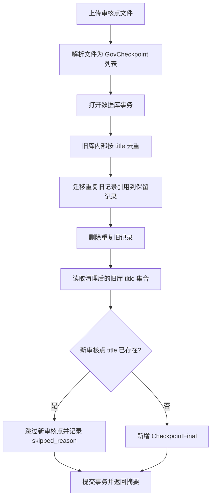

# 审核点按标题去重设计

## 1. 背景

手动导入审核点表格时，`POST /api/v1/checkpoints/import` 会把解析出的每条
`GovCheckpoint` 直接写入 `CheckpointFinal`。解析器每次都会生成新的随机
`GovCheckpoint.id`，因此重复导入相同文件或相同审核点时，数据库会持续新增重复
`CheckpointFinal`。

本设计只解决手动导入路径的 MVP 去重问题，不新增 API，不改 AI 抽取流程，不引入复杂相似度判断。

## 2. 目标

- 导入前清理 `CheckpointFinal` 旧库内部重复记录。
- 导入时过滤新审核点与旧库的重复记录。
- 重复判定只按审核点标题：`GovCheckpoint.title.strip()`。
- 旧库内部重复时，保留 `approved_at` 最新的记录，删除较旧记录。
- 新导入记录与旧库重复时，保留旧库记录，跳过新记录。
- 保持现有前端/API 调用方式不变。

## 3. 非目标

- 不新增去重端点。
- 不新增数据库唯一索引。
- 不做 `description`、`legal_basis`、`severity` 或语义相似度去重。
- 不修改 `parse_checkpoint_file()` 的随机 ID 生成策略。
- 不处理 AI 抽取路径产生的重复审核点。

## 4. 设计决策

| 决策点 | 结论 | 理由 |
|---|---|---|
| 去重键 | `title.strip()` | 最简单，符合当前需求 |
| 触发时机 | 现有导入端点内部 | 不新增前端和 API 面 |
| 旧库重复保留 | `approved_at` 最新，其次 `id` 字典序较大 | 符合“旧库内部保留较新记录”；同时间时保持确定性 |
| 新旧冲突保留 | 保留旧库，跳过新导入 | 避免重复导入污染数据库 |
| 引用处理 | 删除旧库重复前迁移引用 | 避免 `AuditPointRun` / `AuditRun` 悬空引用 |
| 响应兼容 | 保留现有字段 | 前端无需改造 |

## 5. 数据流



## 6. 组件设计

### 6.1 去重键

新增私有函数：

```text
checkpoint_title_key(payload_json) -> str | None
```

逻辑：

1. 解析 `CheckpointFinal.payload_json` 为 `GovCheckpoint`。
2. 返回 `checkpoint.title.strip()`。
3. title 为空或 JSON/schema 非法时返回 `None`，不参与去重。

非法旧记录不删除，避免因历史脏数据造成误删。

### 6.2 旧库内部去重

新增私有函数：

```text
deduplicate_existing_checkpoints(session) -> DedupStats
```

逻辑：

1. 查询全部 `CheckpointFinal`。
2. 按 `title.strip()` 分组。
3. 每组排序，保留：
   - `approved_at` 最新；
   - 若 `approved_at` 相同，保留 `id` 字典序较大者。
4. 对被删除记录建立 `old_id -> keep_id` 映射。
5. 调用引用迁移逻辑。
6. 删除被替换的旧记录。

返回诊断：

```text
DedupStats(
  removed_existing_count: int,
  rewired_audit_point_runs: int,
  rewired_audit_runs: int,
)
```

### 6.3 引用迁移

需要迁移两类引用：

| 表 | 字段 | 处理 |
|---|---|---|
| `AuditPointRun` | `checkpoint_final_id` | 旧 ID 改为保留 ID |
| `AuditRun` | `checkpoint_final_ids` | JSON 数组内旧 ID 替换为保留 ID，并去重保序 |

`AuditRun.checkpoint_final_ids` 由业务代码生成，正常情况下应为合法 JSON。实现时若遇到非法 JSON，应抛出具名异常并回滚事务，避免半更新和误删。

### 6.4 新导入过滤

在同一个导入事务中，完成旧库去重后：

1. 读取清理后的旧库 title 集合。
2. 遍历解析出的新 `GovCheckpoint`。
3. `title.strip()` 已存在：不写入 DB，追加跳过原因。
4. 不存在：写入 `CheckpointFinal(approved_by="system:import")`，并把 title 加入集合，防止同一文件内部重复导入。

同一上传文件内部出现重复 title 时，保留文件中先出现的那条，跳过后出现的重复记录。

## 7. API 行为

端点不变：

```text
POST /api/v1/checkpoints/import
```

响应字段保持兼容：

```json
{
  "imported_count": 0,
  "skipped_count": 1,
  "skipped_reasons": [
    "审核点标题已存在，跳过导入：1.直接限制"
  ],
  "checkpoints": []
}
```

字段语义：

- `imported_count`: 本次实际新增的审核点数量。
- `skipped_count`: 文件解析跳过数量 + title 重复跳过数量。
- `skipped_reasons`: 继续包含解析跳过原因，并追加重复 title 原因。
- `checkpoints`: 本次实际新增的审核点记录。

旧库内部去重数量暂不加入响应，避免前端契约扩大；后端单测覆盖即可。

## 8. 备选方案与取舍

| 方案 | 结论 | 原因 |
|---|---|---|
| 仅导入时过滤新记录 | 拒绝 | 不能清理已有重复数据 |
| 导入前清理旧库 + 导入时过滤新记录 | 采用 | 符合需求，改动集中 |
| 数据库唯一索引 | 暂缓 | MVP 下迁移和历史数据处理成本较高 |

## 9. 拟议变更

| 文件 | 操作 | 函数/方法级变更 |
|---|---|---|
| `govdoc/api/routes/checkpoints.py` | [MODIFY] | `import_checkpoints()`：导入事务内先清理旧库重复，再按 title 过滤新记录 |
| `govdoc/api/routes/checkpoints.py` | [MODIFY] | 新增 `_checkpoint_title_key()`、`deduplicate_existing_checkpoints()`、`_rewire_checkpoint_references()` |
| `tests/unit/test_checkpoints_route.py` | [MODIFY] | 新增导入重复文件、同文件重复 title、旧库内部重复清理、引用迁移测试 |
| `frontend/e2e/test-02-import-checkpoints.js` | [MODIFY] | 在现有 XLS 导入流程后重复导入同一文件，验证第二次导入不新增审核点 |

MVP 阶段把 helper 放在 `govdoc/api/routes/checkpoints.py` 中，避免新增包结构。

## 10. 验证计划

### 10.1 单元测试

命令：

```bash
source activate govdoc-auditor-v3 && python -m pytest tests/unit/test_checkpoints_route.py -v
```

新增用例：

- 重复导入同一个 CSV：第二次 `imported_count == 0`，DB 总数不增加。
- 单个 CSV 内两个相同 title：只导入第一条，第二条计入 skipped。
- 旧库已有相同 title 的两条记录：导入前清理后只保留 `approved_at` 最新的一条。
- `AuditPointRun.checkpoint_final_id` 指向被删除旧记录时，迁移到保留记录。
- `AuditRun.checkpoint_final_ids` 包含被删除旧记录时，替换为保留记录并去重保序。

### 10.2 回归测试

命令：

```bash
source activate govdoc-auditor-v3 && python -m pytest tests/unit/test_checkpoint_import.py tests/unit/test_checkpoints_route.py -v
```

预期：

- 解析器既有测试继续通过。
- checkpoint route 测试全部通过。

### 10.3 前端 E2E

复用现有 `frontend/e2e/test-02-import-checkpoints.js`，追加重复导入检查：

1. 第一次导入 `real_data/附件9 处理处罚标准.xls`，记录列表行数。
2. 第二次导入同一文件。
3. 验证页面出现成功提示，且成功导入数量为 `0` 或列表行数不增加。
4. 返回审核点列表后，抽样检查表格仍可正常渲染。

运行命令：

```bash
export NO_PROXY="100.70.102.30,100.83.164.94,110.42.53.85,localhost,127.0.0.1"
export no_proxy="$NO_PROXY"
cd frontend && bash e2e/run-tests.sh --only 02-import-checkpoints
```

约束：

- 必须使用 `@playwright/cli` / `npx playwright-cli`。
- 禁止使用 Python `playwright`、`pytest-playwright` 或 `@playwright/test`。
- 该 E2E 只做 UI 回归；去重引用迁移仍以后端单测为准。

### 10.4 手工验证

使用 Swagger 或现有前端连续导入 `real_data/附件9 处理处罚标准.xls` 两次：

- 第一次导入新增审核点。
- 第二次导入 `imported_count == 0` 或仅新增之前不存在的标题。
- `/api/v1/checkpoints` 中相同 title 只保留一条。

## 11. 风险与缓解

| 风险 | 缓解 |
|---|---|
| 仅按 title 去重可能误合并同名不同内容 | 已由需求确认，MVP 接受 |
| 删除旧重复记录可能破坏历史审核运行引用 | 删除前迁移 `AuditPointRun` 和 `AuditRun` 引用 |
| 历史 payload_json 非法导致无法解析 title | 非法记录不参与去重，不自动删除 |
| 同一事务中部分更新失败 | 去重和导入放在同一 DB session/transaction，失败整体回滚 |

## 12. 用户审查点

无新增审查点。用户已确认采用“导入前清理旧库 + 导入时过滤新记录”的方案。
